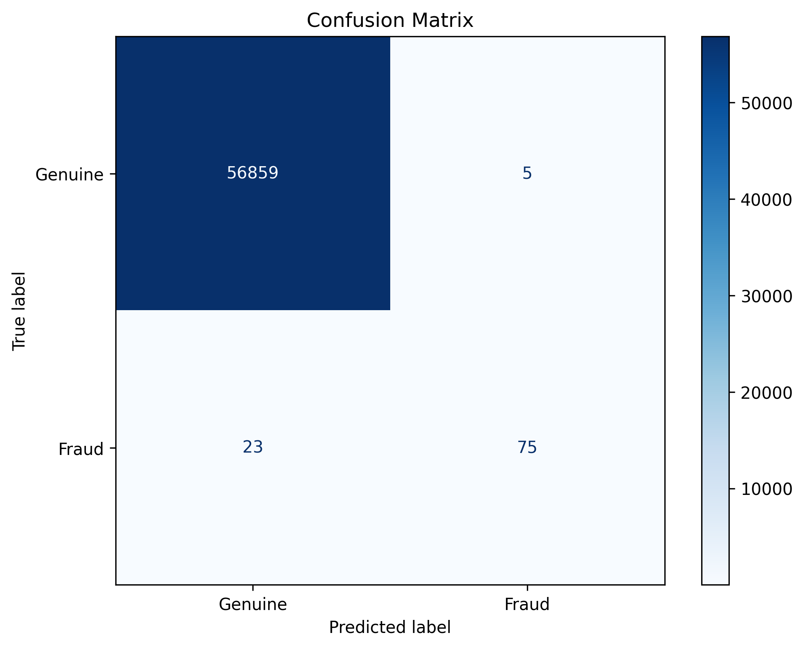

# CICD-for-Machine-Learning: Credit Card Fraud Detection
[](https://github.com/kingabzpro/CICD-for-Machine-Learning/actions/workflows/ci.yml)
[](https://github.com/kingabzpro/CICD-for-Machine-Learning/actions/workflows/cd.yml)
[](https://colab.research.google.com/github/kingabzpro/CICD-for-Machine-Learning/blob/main/notebook.ipynb)

[](https://www.datacamp.com/tutorial/ci-cd-for-machine-learning) [](https://huggingface.co/spaces/kingabzpro/Credit-Card-Fraud-Detection)

Automated MLOps pipeline for credit card fraud detection using scikit-learn, Streamlit, and GitHub Actions.

## Project Description
This project demonstrates an end-to-end machine learning workflow for detecting credit card fraud. It includes:
- Data preprocessing and feature engineering
- Model training with class imbalance handling (SMOTE)
- Automated testing and evaluation
- CI/CD pipeline with GitHub Actions
- Web application deployment with Streamlit

The entire process is automated using GitHub Actions. Push your code to the repository, and the model will be automatically trained, evaluated, and deployed.

## Pipeline


## Dataset
- **Source**: [Credit Card Fraud Detection on Kaggle](https://www.kaggle.com/mlg-ulb/creditcardfraud)
- **Features**: 30 numerical features (anonymized as V1-V28) + Time + Amount
- **Target**: Binary classification (0: Genuine, 1: Fraud)
- **Class Distribution**: Highly imbalanced (0.17% fraud cases)

## Results
| Model                  | Accuracy | F1 Score | Precision | Recall | ROC AUC |
|------------------------|----------|----------|-----------|--------|---------|
| RandomForestClassifier | 99.95%   | 0.8427   | 0.9375    | 0.7653 | 0.9453  |

### Confusion Matrix


## Local Setup
1. Clone the repository
2. Install dependencies:
   ```bash
   pip install -r requirements.txt
   ```
3. Run the Streamlit app:
   ```bash
   streamlit run App/app.py
   ```

## CI/CD Workflow
- **CI Pipeline**:
  - Code formatting with Black
  - Model training and evaluation
  - Performance metrics reporting

- **CD Pipeline**:
  - Model deployment to Hugging Face Spaces
  - Automatic updates on push to main branch
